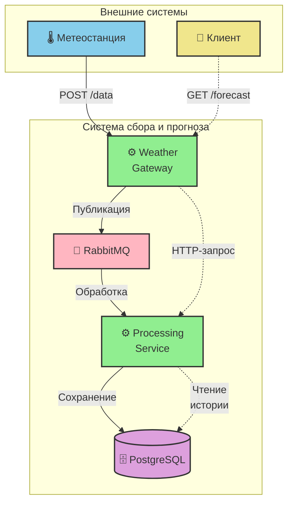

# Система сбора и прогноза погоды

Это тестовый проект, представляющий собой микросервисную систему для сбора погодных данных с метеостанций и предоставления прогнозов на их основе.

## Содержание
- [Архитектура](#архитектура)
    - [Схема взаимодействия](#схема-взаимодействия)
- [Технологический стек](#технологический-стек)
- [Структура проекта](#структура-проекта)
- [Запуск системы](#запуск-системы)
    - [Требования](#требования)
    - [Инструкция по запуску](#инструкция-по-запуску)
    - [Доступ к сервисам](#доступ-к-сервисам)
- [Примеры использования API (cURL)](#примеры-использования-api-curl)
    - [Мониторинг](#мониторинг)
- [Документация](#документация)
- [Контакты](#контакты)

## Архитектура

Система состоит из следующих компонентов:

-   **Weather Gateway Service**: API-шлюз, принимающий данные от станций и запросы на прогноз от клиентов.
-   **Weather Processing Service**: Сервис, который обрабатывает поступающие данные, сохраняет их в базу и генерирует прогнозы.
-   **PostgreSQL**: База данных для хранения исторических погодных данных.
-   **RabbitMQ**: Брокер сообщений для асинхронного взаимодействия между шлюзом и сервисом обработки.

### Схема взаимодействия



## Технологический стек

-   Java 21
-   Spring Boot 3.3
-   Spring Data JPA
-   Spring AMQP (RabbitMQ)
-   Spring WebFlux (для WebClient)
-   PostgreSQL 15
-   Maven
-   Docker & Docker Compose
-   Lombok
-   Spring Boot Actuator

## Структура проекта

Проект является многомодульным Maven-проектом:

-   `weather-system`: Родительский POM.
-   `weather-shared`: Модуль с общими DTO и константами.
-   `weather-gateway`: Модуль API-шлюза.
-   `weather-processing`: Модуль сервиса обработки и прогнозирования.

## Запуск системы

### Требования

-   Java 21+
-   Apache Maven 3.8+
-   Docker и Docker Compose

### Инструкция по запуску

1.  **Сборка проекта**
    Из корневой директории `weather-system` выполните команду для сборки всех модулей:
    ```bash
    mvn clean package
    ```

2.  **Запуск через Docker Compose**
    Эта команда соберет Docker-образы для сервисов и запустит всю систему (включая PostgreSQL и RabbitMQ):
    ```bash
    docker-compose up --build
    ```
    Система будет полностью готова к работе через 1-2 минуты.

### Доступ к сервисам

-   **API Gateway**: `http://localhost:8080`
-   **Processing Service**: `http://localhost:8081`
-   **RabbitMQ Management UI**: `http://localhost:15672` (логин/пароль: `guest`/`guest`)
-   **PostgreSQL**: `localhost:5432`

## Примеры использования API (cURL)

**Важно:** Для получения прогноза сначала необходимо отправить как минимум два набора данных для одной и той же станции.

1.  **Отправка данных с метеостанции**

    Отправим несколько записей для станции `station-01` с интервалом в один час (в Windows выполнить используя cmd).

    ```bash
    curl -X POST http://localhost:8080/api/v1/weather/data -H "Content-Type: application/json" -d "{\"stationId\": \"station-01\", \"timestamp\": \"2025-10-07T10:00:00Z\", \"temperature\": 25.0, \"humidity\": 65.0, \"pressure\": 1013.0, \"precipitation\": 0.0}"
    ```
    ```bash
    curl -X POST http://localhost:8080/api/v1/weather/data -H "Content-Type: application/json" -d "{\"stationId\": \"station-01\", \"timestamp\": \"2025-10-07T11:00:00Z\", \"temperature\": 25.5, \"humidity\": 64.0, \"pressure\": 1012.8, \"precipitation\": 0.0}"
    ```
    В ответ на каждый запрос сервер вернет статус `202 Accepted`.

2.  **Получение прогноза погоды**

    Теперь запросим прогноз для станции `station-01` на следующие 3 часа.

    ```bash
    curl -X GET "http://localhost:8080/api/v1/weather/forecast?stationId=station-01&hours=3"
    ```

    **Пример ответа:**

    ```json
    {
      "stationId": "station-01",
      "generatedAt": "2024-05-21T18:30:00.123456Z",
      "forecasts": [
        {
          "timestamp": "2025-10-07T12:00:00Z",
          "temperature": 26.0,
          "humidity": 63.0,
          "pressure": 1012.6,
          "precipitation": 0.0
        },
        {
          "timestamp": "2025-10-07T13:00:00Z",
          "temperature": 26.5,
          "humidity": 62.0,
          "pressure": 1012.4,
          "precipitation": 0.0
        },
        {
          "timestamp": "2025-10-07T14:00:00Z",
          "temperature": 27.0,
          "humidity": 61.0,
          "pressure": 1012.2,
          "precipitation": 0.0
        }
      ]
    }
    ```

### Мониторинг

Для проверки состояния сервисов можно использовать Actuator health-check эндпоинты:

-   `http://localhost:8080/actuator/health`
-   `http://localhost:8081/actuator/health`

## Документация

| EN                                | RU                                |
|:----------------------------------|:----------------------------------|
| [README на английском](README.md) | [README на русском](README-RU.md) |

## Контакты

Создано [@akardapolov](mailto:akardapolov@yandex.ru)