# Weather Data Collection and Forecasting System

This test project is a microservices system for collecting weather data from weather stations and providing forecasts based on that data.

## Contents
- [Architecture](#architecture)
- [Technology Stack](#technology-stack)
- [Project Structure](#project-structure)
- [Running the System](#running-the-system)
    - [Requirements](#requirements)
    - [Startup Instructions](#startup-instructions)
    - [Service Access](#service-access)
- [API Usage Examples (cURL)](#api-usage-examples-curl)
    - [Monitoring](#monitoring)
- [Documentation](#documentation)
- [Contact](#contact)

## Architecture

The system consists of the following components:

-   **Weather Gateway Service**: API gateway that accepts data from stations and forecast requests from clients.
-   **Weather Processing Service**: Service that processes incoming data, saves it to the database, and generates forecasts.
-   **PostgreSQL**: Database for storing historical weather data.
-   **RabbitMQ**: Message broker for asynchronous communication between the gateway and processing service.

### Interaction Diagram

```mermaid
graph TB
    subgraph "External Systems"
        WS["🌡️ Weather Station"]
        Client["👤 Client"]
    end

    subgraph "Data Collection & Forecasting System"
        direction LR
        GW["⚙️ Weather<br/>Gateway"]
        RMQ["📨 RabbitMQ"]
        PS["⚙️ Processing<br/>Service"]
        DB[("🗄️ PostgreSQL")]
    end

    %% Flow 1: Data Collection (Asynchronous, solid line)
    WS -- "POST /data" --> GW
    GW -- "Publish" --> RMQ
    RMQ -- "Processing" --> PS
    PS -- "Save" --> DB

    %% Flow 2: Forecast Request (Synchronous, dashed line)
    Client -.-> |"GET /forecast"| GW
    GW -.-> |"HTTP Request"| PS
    PS -.-> |"Read<br/>History"| DB

    %% Styles
    classDef station fill:#87CEEB,stroke:#333,stroke-width:2px
    classDef service fill:#90EE90,stroke:#333,stroke-width:2px
    classDef broker fill:#FFB6C1,stroke:#333,stroke-width:2px
    classDef database fill:#DDA0DD,stroke:#333,stroke-width:2px
    classDef client fill:#F0E68C,stroke:#333,stroke-width:2px

    class WS station
    class GW,PS service
    class RMQ broker
    class DB database
    class Client client
```



## Technology Stack

-   Java 21
-   Spring Boot 3.3
-   Spring Data JPA
-   Spring AMQP (RabbitMQ)
-   Spring WebFlux (for WebClient)
-   PostgreSQL 15
-   Maven
-   Docker & Docker Compose
-   Lombok
-   Spring Boot Actuator

## Project Structure

The project is a multi-module Maven project:

-   `weather-system`: Parent POM.
-   `weather-shared`: Module with common DTOs and constants.
-   `weather-gateway`: API gateway module.
-   `weather-processing`: Processing and forecasting service module.

## Running the System

### Requirements

-   Java 21+
-   Apache Maven 3.8+
-   Docker and Docker Compose

### Startup Instructions

1.  **Build the project**
    From the root `weather-system` directory, run the command to build all modules:
    ```bash
    mvn clean package
    ```

2.  **Run via Docker Compose**
    This command will build Docker images for the services and run the entire system (including PostgreSQL and RabbitMQ):
    ```bash
    docker-compose up --build
    ```
    The system will be fully ready to use within 1-2 minutes.

### Service Access

-   **API Gateway**: `http://localhost:8080`
-   **Processing Service**: `http://localhost:8081`
-   **RabbitMQ Management UI**: `http://localhost:15672` (login/password: `guest`/`guest`)
-   **PostgreSQL**: `localhost:5432`

## API Usage Examples (cURL)

**Important:** To get a forecast, you must first send at least two data sets for the same station.

1.  **Sending data from a weather station**

    Let's send several records for station `station-01` with a one-hour interval (on Windows, execute using cmd).

    ```bash
    curl -X POST http://localhost:8080/api/v1/weather/data -H "Content-Type: application/json" -d "{\"stationId\": \"station-01\", \"timestamp\": \"2025-10-07T10:00:00Z\", \"temperature\": 25.0, \"humidity\": 65.0, \"pressure\": 1013.0, \"precipitation\": 0.0}"
    ```
    ```bash
    curl -X POST http://localhost:8080/api/v1/weather/data -H "Content-Type: application/json" -d "{\"stationId\": \"station-01\", \"timestamp\": \"2025-10-07T11:00:00Z\", \"temperature\": 25.5, \"humidity\": 64.0, \"pressure\": 1012.8, \"precipitation\": 0.0}"
    ```
    The server will return a `202 Accepted` status for each request.

2.  **Getting a weather forecast**

    Now let's request a forecast for station `station-01` for the next 3 hours.

    ```bash
    curl -X GET "http://localhost:8080/api/v1/weather/forecast?stationId=station-01&hours=3"
    ```

    **Example response:**

    ```json
    {
      "stationId": "station-01",
      "generatedAt": "2024-05-21T18:30:00.123456Z",
      "forecasts": [
        {
          "timestamp": "2025-10-07T12:00:00Z",
          "temperature": 26.0,
          "humidity": 63.0,
          "pressure": 1012.6,
          "precipitation": 0.0
        },
        {
          "timestamp": "2025-10-07T13:00:00Z",
          "temperature": 26.5,
          "humidity": 62.0,
          "pressure": 1012.4,
          "precipitation": 0.0
        },
        {
          "timestamp": "2025-10-07T14:00:00Z",
          "temperature": 27.0,
          "humidity": 61.0,
          "pressure": 1012.2,
          "precipitation": 0.0
        }
      ]
    }
    ```

### Monitoring

To check the status of services, you can use the Actuator health-check endpoints:

-   `http://localhost:8080/actuator/health`
-   `http://localhost:8081/actuator/health`

## Documentation

| EN                             | RU                                |
|:-------------------------------|:----------------------------------|
| [README in English](README.md) | [README на русском](README-RU.md) |

## Contact
Created by [@akardapolov](mailto:akardapolov@yandex.ru)